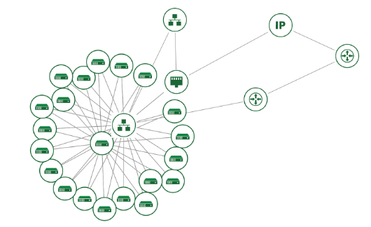

# Distributed Machine Learning with PyTorch Lightning and OpenStack Heat
This work was completed as part of our graduate course in distributed systems.

By: Nisala Kalupahana, Rohit Khurana, and Ethan Nguyen

## Introduction


**Abstract:** Rapid advancements in machine learning have enabled computers to perform increasingly difficult tasks with similar accuracy to humans. The more powerful and complex models require a larger number of parameters to be optimized and thus more computational resources. These resources are typically distributed in nature - for example, across nodes in a compute cluster or, at its simplest level, across GPUs on the same device. In particular, the cloud conveniently offers users a unique opportunity to access these on-demand resources for their downstream training tasks. Here, we present a unified framework for users and researchers to automatically scale their training efforts across multiple virtual machine instances without any manual intervention. Through this workflow, individuals will be able to train their model faster by distributing the workload across all devices registered on a node and across nodes. We demo this framework on the MNIST database using Chameleon cloud and observe decreases in overall training time with no performance degradation compared to a traditional single node setup. 

Feel free to read our [report](docs/distributed_systems_final_paper.pdf) for more details.

## Usage
To use this framework, you will need to have a cloud account with a provider that supports OpenStack Heat. We have tested this on Chameleon Cloud.

First, clone this repository:
```bash
git clone https://github.com/EthanHNguyen/distributed-ml.git
```

Next, run the generator script:
```bash
python cloud/generator.py
```

The generator will prompt you for the following information:
* "Enter an HTTPS .git repo URL to clone"
* "How many workers would you like to run? (min 0, max 254)"
* "What directory is your requirements.txt in? (. for root directory of repo)"
* "What Python file is your entrypoint in, relative to that directory? (e.g. main.py)"



The generator will then generate a stack template for you to use that describes a network topology (see above) with a master node and a number of worker nodes. The master node will clone the specified git repository and run the specified Python file. The worker nodes will clone the same git repository and run the specified Python file, but will also run a script that will connect to the master node and run the same Python file. The master node will then wait for all workers to finish before exiting.

To deploy, upload the generated stack template to your cloud provider of choice. We have tested this on Chameleon Cloud.